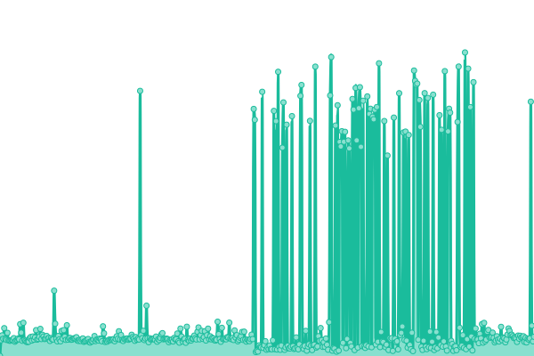
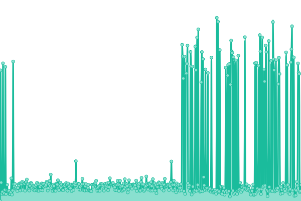
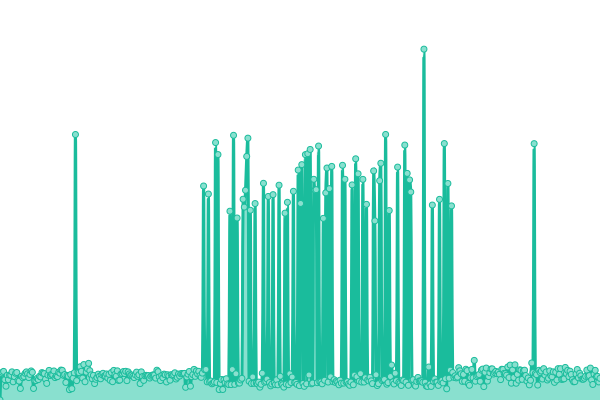
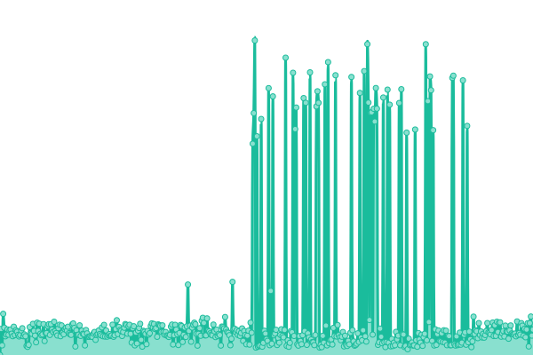
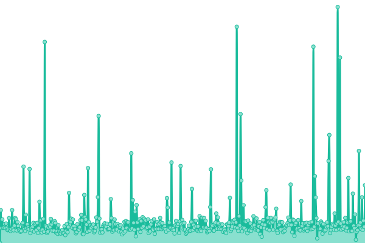

# [📈 Live Status](https://status.rtapp.tk): <!--live status--> **🟧 Partial outage**

This repository contains the open-source uptime monitor and status page for [Recap Time](https://recaptime.tk), powered by [Upptime](https://github.com/upptime/upptime).

With [Upptime](https://upptime.js.org), you can get your own unlimited and free uptime monitor and status page, powered entirely by a GitHub repository. We use [Issues](https://github.com/RecapTime/status-page/issues) as incident reports, [Actions](https://github.com/RecapTime/status-page/actions) as uptime monitors, and [Pages](https://status.rtapp.tk) for the status page.

<!--start: status pages-->
<!-- This summary is generated by Upptime (https://github.com/upptime/upptime) -->
<!-- Do not edit this manually, your changes will be overwritten -->
<!-- prettier-ignore -->
| URL | Status | History | Response Time | Uptime |
| --- | ------ | ------- | ------------- | ------ |
|  [Squad Website](https://recaptime.tk) | 🟥 Down | [squad-website.yml](https://github.com/RecapTime/status-page/commits/HEAD/history/squad-website.yml) | 

 210ms
     
 | 

<a href="https://status.rtapp.tk/history/squad-website">93.07%</a>
    

|  [Vaultwarden - Self-hosted Public](https://bw.rtapp.tk/alive) | 🟩 Up | [vaultwarden-self-hosted-public.yml](https://github.com/RecapTime/status-page/commits/HEAD/history/vaultwarden-self-hosted-public.yml) | 

 423ms
     
 | 

<a href="https://status.rtapp.tk/history/vaultwarden-self-hosted-public">100.00%</a>
    

|  [golinks](https://go.rtapp.tk/ping) | 🟩 Up | [golinks.yml](https://github.com/RecapTime/status-page/commits/HEAD/history/golinks.yml) | 

 532ms
     
 | 

<a href="https://status.rtapp.tk/history/golinks">99.53%</a>
    

|  [Link Shortener Service](https://rtapp.tk) | 🟥 Down | [link-shortener-service.yml](https://github.com/RecapTime/status-page/commits/HEAD/history/link-shortener-service.yml) | 

 345ms
     
 | 

<a href="https://status.rtapp.tk/history/link-shortener-service">76.23%</a>
    

|  [Squad Wiki](https://wiki.rtapp.tk) | 🟩 Up | [squad-wiki.yml](https://github.com/RecapTime/status-page/commits/HEAD/history/squad-wiki.yml) | 

 518ms
     
 | 

<a href="https://status.rtapp.tk/history/squad-wiki">99.84%</a>
    

<!--end: status pages-->

[**Visit our status website →**](https://status.rtapp.tk)

## 📄 License

- Powered by: [Upptime](https://github.com/upptime/upptime)
- Code: [MIT](./LICENSE) © [Recap Time](https://recaptime.tk)
- Data in the `./history` directory: [Open Database License](https://opendatacommons.org/licenses/odbl/1-0/)
